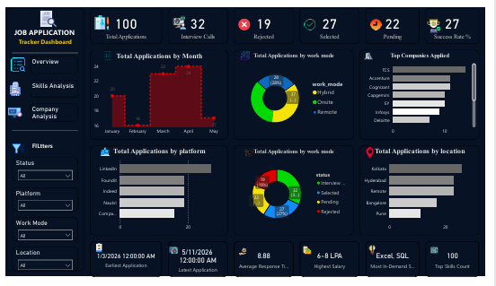

# Job Application Tracker Dashboard

## Project Overview
This project is built using MySQL and Power BI to analyze job applications, interview rates, hiring trends, and skill demand.

---

## Tools Used
- MySQL
- Power BI
- Excel

---

## Features
- KPI Cards
- Interactive Dashboard
- Sparkline Charts
- Slicers and Filters
- Company Analysis
- Skills Analysis
- Dark Theme Dashboard

---

## Dashboard Pages

### Overview
- Total Applications
- Interview Calls
- Success Rate
- Application Trends

### Company Analysis
- Top Companies Applied
- Salary Analysis
- Hiring Trends

### Skills Analysis
- SQL vs Power BI
- Most Demanded Skills

---

## Dashboard Preview

---

## Author
Pradip Das

